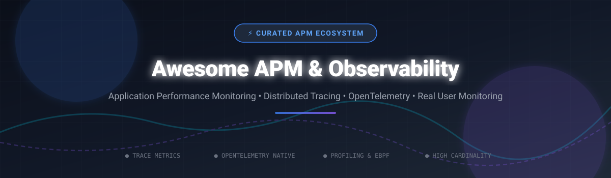

# Awesome-Application-Performance-Monitoring-Apm 📊 🔍

  

  
  
  
  
  
  

---

## 🌟 Top Application Performance Monitoring (APM) & Observability Ecosystem ⚡

**Curated List of Commercial APM Platforms & Open-Source Observability Alternatives**  
*Focused on Distributed Tracing, Code-Level Profiling, Error Tracking, Real User Monitoring (RUM), eBPF Profiling & Self-Hosted Telemetry Pipelines* 🚀  

**Last updated: October 2026** 📅

---

### 📌 SEO & Industry Overview 🔍
Welcome to the definitive curated directory of **application performance monitoring (APM) tools**, **distributed tracing backends**, **OpenTelemetry collector pipelines**, and **cloud-native observability frameworks**. Modern microservice architectures demand end-to-end telemetry across metrics, logs, traces, and continuous profiling. Whether you are evaluating enterprise SaaS solutions (*Datadog APM*, *New Relic*, *Dynatrace*, *Splunk Observability*) or deploying self-hosted open-source stacks (*SigNoz*, *Grafana Tempo*, *Jaeger*, *Apache SkyWalking*, *OpenObserve*), this repository provides comprehensive pricing comparisons, market valuations, and star counts.

---

## 📑 Table of Contents 📖
- [🏢 SaaS & Commercial APM Platforms](#-saas--commercial-apm-platforms)
- [🔓 Open-Source Observability Projects](#-open-source-observability-projects)
- [🛠️ How to Contribute](#%EF%B8%8F-how-to-contribute)
- [📈 Star History](#-star-history)
- [🤝 Support & Sponsorship](#-support--sponsorship)
- [⚠️ Disclaimer & Security](#%EF%B8%8F-disclaimer--security)

---

## 🏢 SaaS / Commercial APM Platforms 💼

> **Market Insights & Industry Dynamics:** 📊  
> The global Application Performance Monitoring (APM) and Observability market is estimated at **$5.5 Billion to $6.2 Billion in 2026** and projected to exceed **$12.5 Billion by 2032** (growing at a CAGR of ~11.8%). The market is **moderately concentrated** at the top tier among major full-stack telemetry providers (Datadog, Dynatrace, Cisco/Splunk/AppDynamics, AWS), while remaining **fragmented** in specialized developer-first verticals (error tracking, high-cardinality event analytics, and LLM tracing).

*Sorted by Company Valuation / Market Capitalization (Descending)* 📉

| SaaS / Commercial Platform | Company / Owner | Valuation / Market Cap 💰 | Standard Edition Starting Price 🏷️ | Free Tier / Free Trial Limits 🎁 | Description & Core Features 📝 |
| :--- | :--- | :--- | :--- | :--- | :--- |
| **[AWS Application Signals](https://aws.amazon.com/cloudwatch/)** ☁️ | Amazon Inc. | **~$2.0 Trillion** | Pay-as-you-go ($0.35/alarm/month, $0.05/1K metric requests, $0.50/GB ingested traces) | **Free Tier: 10 custom metrics, 5 GB log ingest, 1M trace requests/month forever** | **AWS-native APM** — Part of CloudWatch. Application Signals automatically instruments services, tracks SLOs, and correlates with AWS infrastructure resources. 🛠️ |
| **[AppDynamics](https://www.appdynamics.com/)** 🎯 | Cisco Systems Inc. | **~$200 Billion** | $60/month per CPU core (Infrastructure Monitoring Edition); $90/month per APM CPU core | **15-day free trial (up to 5 agents)**; no permanent free tier | **Enterprise APM** — Business transaction monitoring, code-level diagnostics, network visibility, and full-stack observability. Part of Cisco's enterprise security & visibility portfolio. 🏢 |
| **[Splunk APM](https://www.splunk.com/en_us/products/observability-cloud.html)** 📈 | Cisco Systems Inc. | **~$200 Billion** | $75/host/month (End-to-End edition, unmetered ingest); $60/host/month (App + Infra) | **14-day free trial (unlimited features, up to 15 hosts)**; no permanent free tier | **Streaming analytics APM** — Built on SignalFx and Omnition acquisitions. Per-host pricing with **unmetered telemetry ingest** — cost stays flat as log/trace volume grows. Real-time streaming analytics. ⚡ |
| **[Instana](https://www.ibm.com/products/instana)** ⚡ | IBM Corp. | **~$200 Billion** | $21.20/MVS/month (SaaS, annual); $385.20/MVS/year (Self-Hosted); $0.03/MVS-hour (PayPerUse) | **14-day free trial (full features, unlimited agents)**; no permanent free tier | **Automated APM & Observability** — 1-second monitoring granularity, automated discovery, 300+ technology integrations. Unlimited users included. Fair use: 325 GB data ingest per Standard SaaS MVS. 🤖 |
| **[Datadog APM](https://www.datadoghq.com/product/apm/)** 🐶 | Datadog Inc. | **~$40 Billion** | $31/host/month (APM & Continuous Profiler); $35/host/month (Pro); $40/host/month (Enterprise) | **14-day free trial (unlimited hosts and features)**; no permanent free tier | **Full-stack observability leader** — Distributed tracing, code profiling ($2/additional container beyond 4/host). Indexed spans: $1.70/million after 5M included. Ingested spans: $0.10/GB after 750 GB included. 📊 |
| **[Dynatrace](https://www.dynatrace.com/)** 🔮 | Dynatrace Inc. | **~$15 Billion** | $0.04/hour per host (Infrastructure); $0.01/memory-GiB-hour (Full-Stack APM) | **15-day free trial (1K host-hours included)**; no permanent free tier | **Causal AI for root cause** — Davis AI combines topology mapping with causal root-cause analysis. Commitment-based annual pricing with rate-card drawdown. No overage penalties. 🧠 |
| **[Elastic APM](https://www.elastic.co/apm/)** 🔍 | Elastic N.V. | **~$10 Billion** | $99/month (Standard, 120 GB RAM capacity, 2-zone reference); $114/month (Gold); $131/month (Platinum) | **14-day free trial (Elastic Cloud hosted)**; Free self-managed tier for basic Elastic Stack features | **OpenTelemetry-native APM** — Distributed tracing, metrics, and logs integrated into Elastic Stack. Deployment capacity (GB RAM/hour) is largest billing component. Full EDOT distribution support. 🔎 |
| **[New Relic](https://newrelic.com/)** 🚀 | New Relic Inc. | **~$5 Billion** | $99/user/month (Standard); $349/user/month (Pro, annual billing) + $0.40/GB ingested data | **Free Tier: 100 GB/month ingested data + 1 full-platform user forever** | **Consumption-based full-stack** — $0.40/GB standard data ingest, $0.60/GB Data Plus (HIPAA/FedRAMP compliant). 25+ language agents, 700+ integrations. No per-host charges. 📈 |
| **[Honeycomb](https://www.honeycomb.io/)** 🍯 | Honeycomb.io Inc. | **~$1.5 Billion** (Private) | Pro Plan: from $130/month (includes 1.5 Billion events/month); $3.00 per additional million events | **Free Tier: 20 Million events/month + 100 Million metrics data points forever** | **Event-based observability** — High-cardinality debugging, BubbleUp automated anomaly analysis, OpenTelemetry-native telemetry backend. Includes Time Series Metrics & Honeycomb Intelligence. 🐝 |
| **[Sentry](https://sentry.io/)** 🎯 | Functional Software Inc. | **~$1.0 Billion** (Private) | $26/month (Team plan, 50K errors/month); $80/month (Business plan, SSO & 90-day insights) | **Free Developer Tier: 5,000 errors/month, 10K transactions/month, 1 user forever** | **Developer-first error tracking + APM** — Five metered categories (errors, spans, replays, logs, attachments) each with separate quota. Seer AI debugging: $40/month per active code contributor. 🛠️ |

---

## 🔓 Open-Source Observability Projects 🌐

*Sorted by GitHub Stars Count (Descending)* 🌟

- **[Grafana Loki](https://github.com/grafana/loki)**   
  **Like Prometheus, but for logs**, AGPL-3.0 licensed. ~26k+ stars. Cost-efficient log aggregation system that indexes metadata rather than full payload text. Deeply integrated with Grafana and Tempo for full-stack telemetry correlation. 📝

- **[Apache SkyWalking](https://github.com/apache/skywalking)**   
  **Observability platform for distributed systems**, Apache-2.0 licensed. ~24k+ stars. APM, service mesh telemetry, eBPF profiling, and metrics aggregation. Built for cloud-native, microservices, and Kubernetes architectures. 🌌

- **[SigNoz](https://github.com/SigNoz/signoz)**   
  **Open-source Datadog alternative with OpenTelemetry-native APM**, Apache-2.0 licensed. ~22k+ stars. Unified logs, traces, and metrics in a single pane of glass. ClickHouse-powered backend for high-cardinality telemetry. Self-hosted or SigNoz Cloud. 📊

- **[Jaeger](https://github.com/jaegertracing/jaeger)**   
  **Distributed tracing platform originally created by Uber**, Apache-2.0 licensed. ~21k+ stars. End-to-end distributed tracing, root cause analysis, and service dependency mapping. CNCF graduated project. 🕵️

- **[Haystack](https://github.com/deepset-ai/haystack)**   
  **AI orchestration & pipeline observability framework**, Apache-2.0 licensed. ~20k+ stars. Provides end-to-end tracing and performance monitoring for LLM pipelines and semantic search applications. 🔍

- **[Prometheus](https://github.com/prometheus/prometheus)**   
  **Systems monitoring and alerting toolkit**, Apache-2.0 licensed. ~55k+ stars. CNCF core project featuring time-series metrics collection, PromQL query language, and powerful alert management for APM pipelines. 🔥

- **[Pinpoint](https://github.com/pinpoint-apm/pinpoint)**   
  **APM for large-scale distributed systems**, Apache-2.0 licensed. ~13k+ stars. Java/PHP/Python agent-based monitoring with near-zero overhead. Interactive call stack visualization, real-time server topology maps, and active thread monitoring. 📍

- **[OpenObserve](https://github.com/openobserve/openobserve)**   
  **Cloud-native observability platform written in Rust**, Apache-2.0 licensed. ~12k+ stars. Unified logs, metrics, traces, and RUM in a single binary. Delivers up to 140x lower storage costs than traditional Elasticsearch setups. 🌊

- **[OpenTelemetry Collector](https://github.com/open-telemetry/opentelemetry-collector)**   
  **Vendor-neutral telemetry processing engine**, Apache-2.0 licensed. ~7k+ stars for Collector; 100+ language SDK libraries. CNCF industry standard for receiving, processing, and exporting telemetry data. 🔭

- **[Grafana Tempo](https://github.com/grafana/tempo)**   
  **High-scale distributed tracing backend**, AGPL-3.0 licensed. ~5k+ stars. Extremely cost-effective trace storage requiring only object storage (S3/GCS). Seamless integration with Grafana dashboarding and TraceQL querying. 📈

- **[Traceloop OpenLLMetry](https://github.com/traceloop/openllmetry)**   
  **OpenTelemetry-based observability for LLM applications**, Apache-2.0 licensed. ~5k+ stars. Tracing, prompt evaluation, and cost tracking for AI applications using OpenAI, Anthropic, LangChain, and LlamaIndex. 🤖

- **[Uptrace](https://github.com/uptrace/uptrace)**   
  **Open-source APM powered by OpenTelemetry & ClickHouse**, BSD-2-Clause licensed. ~3k+ stars. Unified distributed tracing, metrics, and log analysis platform with Prometheus and Zipkin ingestion support. 📉

- **[Glances](https://github.com/nicolargo/glances)**   
  **An Open Source Python-based cross-platform system monitoring tool**, LGPL-3.0 licensed. ~26k+ stars. Real-time CPU, memory, disk, network, and process performance monitoring with Web GUI and RESTful API. 💻

- **[Zipkin](https://github.com/openzipkin/zipkin)**   
  **Distributed tracing system**, Apache-2.0 licensed. ~16k+ stars. Helps gather timing data needed to troubleshoot latency problems in microservice architectures. Original pioneer of open distributed tracing. ⏱️

- **[Hypertrace](https://github.com/hypertrace/hypertrace)**   
  **Observability platform for cloud-native apps & microservices**, Apache-2.0 licensed. ~1.5k+ stars. Distributed tracing, service dependency graphs, and trace-to-log correlation built on OpenTelemetry. 🔗

- **[SkyWalking Rover](https://github.com/apache/skywalking-rover)**   
  **eBPF-based continuous profiler & network monitor for SkyWalking**, Apache-2.0 licensed. ~500+ stars. Low-overhead kernel-level CPU profiling and network latency monitoring for Linux environments. 🛰️

---

## 🛠️ How to Contribute 🤝

Contributions are welcome! Follow these steps to submit new APM platforms or open-source observability software:

1. 🍴 **Fork** the repository.
2. 📝 **Add/edit** entries in `README.md` maintaining table/list structure and formatting.
3. 🔗 Include project title, official website/GitHub link, exact star count badge, license, and brief description.
4. 🚀 Submit a **Pull Request** with a descriptive summary of your changes.

---

## 📈 Star History

---

## 🤝 Support & Sponsorship 💖

If you find this Application Performance Monitoring (APM) directory useful, please consider supporting the project:

- ⭐ **Star** this repository to increase visibility!
- 🔀 **Fork** and share with fellow developers, SREs, and DevOps engineers.
- ☕ **Sponsor & Buy Me a Coffee**: Support ongoing open-source curation via the [GitHub Sponsor Dashboard](https://github.com/sponsors/ishandutta2007).

---

## ⚠️ Disclaimer & Security 🔒

- This is a **community-curated** directory — not an exhaustive list or direct commercial endorsement. ℹ️
- APM platforms ingest sensitive production telemetry (headers, SQL queries, user payloads). **Review data retention, masking rules, sampling rates, and privacy compliance (GDPR/HIPAA)** before committing data. 🔒
- Open-source APM solutions (SigNoz, OpenTelemetry, Jaeger, Grafana Tempo) provide self-hosted ownership and complete vendor neutrality, but enterprise-grade SLA guarantees, managed scaling, and 24/7 support remain primarily commercial offerings. 📊

---

  <b>Made with ❤️ for developers, SREs, and open-source observability advocates.</b>

